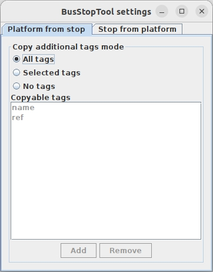

# BusStopTool plugin

## Description
BusStopTool is a plugin that allows you to add missing public transport objects derived from existing elements.

It can create:
- `public_transport=stop_position` node from a `highway=bus_stop` or `highway=platform`.
- `public_transport=platform` node, way (open/closed) or multipolygon relation from a `stop_position` node.

The plugin inserts missing memberships in route relations for multiple relations and ensures they are placed in the correct order.

## Usage
Example scenario: You need to create `highway=bus_stop;public_transport=platform` from `public_transport=stop_position` on the road and 
add it to multiple relations in the correct order. Instead of manually clicking:
1. Open the BusStopTool create platform/stop dialog from Menu -> Selection.
2. Select the source object
3. Select the destination object (the object must exist, but can be empty)
4. Click Create

To use it properly, ensure that the relation follows the PTv2 standard with members ordered as `stop, platform, stop, platform...`.

You can also decide which tags should be copied between both actions (`stop`->`platform` and `platform`->`stop`).
Open settings by Menu -> Data -> BusStopTool Settings and change _Copy additional tags mode_. \
Note: Base tags will still be created even if you select `No tags`.

Tip: You can also select 2 objects before opening the dialog – they will be preselected (the order matters). \
Tip2: You can pin actions to the toolbar or assign shortcuts to the actions (type `busstoptool` in shortcut settings).

## License
[GPLv3](LICENSE)